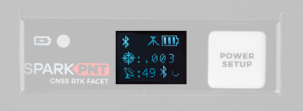

The RTK Facet mosaic is a fully enclosed and pre-programmed device. There are very few things to worry about or configure, but we will cover the basics here.

## :material-folder-cog: Design Files
The design of the SparkPNT RTK Facet mosaic L-Band is similar to previous generations in our line Facet line of products. However, we have made some modifications to the design to enhance the durability of this product. The PCB design features three separate board components:

- A central board that hosts primary components of the RTK Facet mosaic, such as the ESP32-WROVER-E, mosaic-X5, etc.
- A peripheral board that provides connections to the RTK Facet mosaic
- A display board that is the primary interface for the RTK Facet mosaic

<!-- Import the component -->

-   Design Files

	---

	- :kicad-primary:{ .enlarge-logo }
		- :material-folder-zip: [Schematics](./assets/board_files/schematics.zip)
			- :fontawesome-solid-file-pdf: [Connector Board](./assets/board_files/schematic-connector_board.pdf)
			- :fontawesome-solid-file-pdf: [Display Board](./assets/board_files/schematic-display_board.pdf)
			- :fontawesome-solid-file-pdf: [Main Board](./assets/board_files/schematic-main_board.pdf)
		- :material-folder-zip: [KiCad Files](./assets/board_files/kicad_files.zip)
			- :material-folder-zip: [Connector Board](./assets/board_files/kicad_files-connector_board.zip)
			- :material-folder-zip: [Display Board](./assets/board_files/kicad_files-display_board.zip)
			- :material-folder-zip: [Main Board](./assets/board_files/kicad_files-main_board.zip)
	- :material-folder-zip: [STEP Files](./assets/3d_model/step_files.zip)
		- :material-cube-outline: [Connector Board](./assets/3d_model/connector_board.step)
		- :material-cube-outline: [Display Board](./assets/3d_model/display_board.step)
		- :material-cube-outline: [Main Board](./assets/3d_model/main_board.step)
	<!-- - :material-rotate-3d: [STEP File](./assets/3d_model/cad_model.zip) -->
	<!-- - :fontawesome-solid-file-pdf: [Board Dimensions](./assets/board_files/dimensions.pdf) -->

-   <!-- Boxes in tabs -->

	=== "Connector Board"
		

		<model-viewer src="../assets/3d_model/connector_board.glb" poster="../assets/3d_model/poster-connector_board.jpeg" camera-controls tone-mapping="neutral" poster="poster.jpeg" shadow-intensity="1.35" exposure="0.6" shadow-softness="0.8" environment-image="legacy" camera-orbit="0.0004711deg 90.01deg 108.5m" field-of-view="25.11deg" style="width: 100%; height: 450px;">
		</model-viewer>
		

	=== "Display Board"
		

		<model-viewer src="../assets/3d_model/display_board.glb" poster="../assets/3d_model/poster-display_board.jpeg" camera-controls tone-mapping="neutral" poster="poster.jpeg" shadow-intensity="1.35" environment-image="legacy" exposure="0.6" shadow-softness="0.8" camera-orbit="-0.0002197deg 89.6deg 101.9m" field-of-view="25.11deg" style="width: 100%; height: 450px;">
		</model-viewer>
		

	=== "Main Board"
		

		<model-viewer src="../assets/3d_model/main_board.glb" poster="../assets/3d_model/poster-main_board.jpeg" camera-controls tone-mapping="neutral" poster="poster.jpeg" camera-controls tone-mapping="neutral" poster="poster.jpeg" shadow-intensity="1.35" camera-orbit="0deg 90deg 110m" field-of-view="25.11deg" environment-image="legacy" exposure="0.6" shadow-softness="0.8" style="width: 100%; height: 450px;">
		</model-viewer>
		

	??? tip "Need Dimensions?"
		For the board dimensions, users can download the [KiCad files](./assets/board_files/kicad_files.zip) for these board. These files can be opened in KiCad and measurements can be made with the measuring tool.

		!!! info ":octicons-download-16:{ .heart } KiCad - Free Download!"
			KiCad is free, open-source [CAD]("computer-aided design") program for electronics. Click on the button below to download their software. *(\*Users can find out more information about KiCad from their [website](https://www.kicad.org/).)*

			

			[Download :kicad-primary:{ .enlarge-logo }](https://www.kicad.org/download/ "Go to downloads page"){ .md-button .md-button--primary width="250px" }
			

		??? info ":straight_ruler: Measuring Tool"
			This video demonstrates how to utilize the dimensions tool in KiCad, to include additional measurements:

			

			<article class="video-500px">
			<iframe src="https://www.youtube.com/embed/-eXuD8pkCYw" title="KiCad Dimension Tool" frameborder="0" allow="accelerometer; autoplay; clipboard-write; encrypted-media; gyroscope; picture-in-picture" allowfullscreen></iframe>
			</article>
			{ .qr }
			

## Replacement Parts

??? abstract "Kit Parts"
	

	-   <a href="https://www.sparkfun.com/sparkpnt-rtk-facet-ruggedized-hardcase.html">
		<figure markdown>
		
		</figure>

		---

		**SparkPNT RTK Facet Ruggedized Hardcase** 
		PRT-27115</a>

	-   <a href="https://www.sparkfun.com/antenna-thread-adapter-1-4in-to-5-8in.html">
		<figure markdown>
		
		</figure>

		---

		**Antenna Thread Adapter - 1/4in. to 5/8in.** 
		PRT-17546</a>

	-   <a href="https://www.sparkfun.com/jst-ghr-04v-to-jst-ghr-06v-cable-1-25mm-pitch.html">
		<figure markdown>
		
		</figure>

		---

		**JST-GHR-04V to JST-GHR-06V Cable - 1.25mm pitch** 
		CAB-17239</a>

	-   <a href="https://www.sparkfun.com/breadboard-to-jst-ghr-04v-cable-4-pin-x-1-25mm-pitch.html">
		<figure markdown>
		
		</figure>

		---

		**Breadboard to JST-GHR-04V Cable - 4-Pin x 1.25mm Pitch** 
		CAB-17240</a>

	-   <a href="https://www.sparkfun.com/usb-c-to-usb-c-silicone-power-charging-cable-3m.html">
		<figure markdown>
		
		</figure>

		---

		**USB-A to USB-C Cable - 3m (Flexible Silicone)** 
		CAB-24060</a>

	-   <a href="https://www.sparkfun.com/usb-a-and-c-power-delivery-pd-wall-adapter-65w.html">
		<figure markdown>
		
		</figure>

		---

		**USB A and C Power Delivery (PD) Wall Adapter - 65W** 
		TOL-24059</a>

	

??? abstract "Internal Components"
	- M2.2-0.98 x 10mm Thread Forming Screws - Phillips Head
	- M3-1.34 x 10mm Thread Forming Screws - Phillips Head

## Power/Setup Button

<figure markdown>
[{ width="500" }](./assets/img/hookup_guide/button-external_power-setup.png "Click to enlarge")
<figcaption markdown>
</figcaption>
The ++"POWER/SETUP"++ button on the front of the RTK Facet mosaic.
</figure>

The RTK Facet mosaic has a ++"POWER/SETUP"++ button to turn the device on/off or for in-field configuration changes.

- Press and hold the button down, to power the RTK Facet mosaic `ON` or `OFF`.
- Short presses of the button will cause the RTK Facet mosaic to change modes. This device can be used in five modes:
	- **Rover**
		- GNSS Positioning (~30cm accuracy) - also known as **Rover**
		- GNSS Positioning with RTK (1.4cm accuracy) - also known as **Rover** *with RTK Fix*
		- GNSS Positioning with RTK L-Band (1.4 to 6cm accuracy) - also known as **Rover** *with L-Band RTK Fix*
	- **Base**
		- GNSS **Base** Station
		- GNSS **Base** Station *as NTRIP Server*

### Power Switch

<figure markdown>

<figcaption markdown>
The splash screen of RTK Facet mosaic display showing the firmware version number and the device powering off.
</figcaption>
</figure>

The Power button turns the unit on or off:

- Press and hold the power button until the display illuminates.
- Press and hold the power button at any time to turn the unit off.

#### Battery Power

<figure markdown>

<figcaption markdown>
RTK Facet mosaic display, showing the battery level.
</figcaption>
</figure>

The RTK Facet mosaic has a large, built-in 6000mAh lithium polymer battery that will enable over **25 hours** of field use between charging. If more time is needed a common USB power bank can be attached boosting the field time to any amount needed.

!!! info
	For more information, please refer to the [**Internal Batter** section](./hardware_overview.md/#internal-battery)

#### Charge LED

<figure markdown>
[{ width="500" }](./assets/img/hookup_guide/LED-charge.png "Click to enlarge")
<figcaption markdown>
Charge LED indicator on the RTK Facet mosaic.
</figcaption>
</figure>

The Charge LED is located on the front face. It will illuminate any time there is an external power source and will turn off when the internal battery is charged. With the unit fully powered down, charging takes approximately **6 hours** from a 1A wall supply or **12 hours** from a standard USB port. The RTK Facet mosaic can run while being charged but it increases the charge time. Using an external USB battery bank to run the device for extended periods or running the device on a permanent wall power source is supported.

### Operation Modes

At *Power On* the device will enter **Rover** or **Base** mode; whichever state the device was in at the last power down. When the ++"POWER/SETUP"++ button is pressed momentarily, a menu is presented to change the RTK Facet mosaic from **Rover** to **Base** mode or vice-versa. The display will indicate the change with a small car :material-van-utility: *(Rover)* or flag :material-flag-checkered: *(Base)* icon.

!!! info "**Rover** Mode"
	In **Rover** mode the RTK Facet mosaic will receive `L1`, `L2`, and `L5` GNSS signals from the four constellations (GPS, GLONASS, Galileo, and BeiDou) and calculate the position based on these signals. Similar to a standard grade GPS receiver, the RTK Facet mosaic will output industry standard NMEA sentences at 4Hz and broadcast them over any paired Bluetooth® device. The end user will need to parse the NMEA sentences using commonly available mobile apps, GIS products, or embedded devices (there are many open source libraries). Unlike standard grade GPS receivers that have **2500mm** accuracy, the accuracy in this mode is approximately **300mm** horizontal positional accuracy.

	- *w/ RTK Fix*

		:	If the device is in **Rover** mode but L-Band is not available, regular RTCM based RTK is still available. When RTCM correction data is sent over Bluetooth® or into the radio port, the device will automatically enter Positioning with RTK mode. In this mode RTK Facet mosaic will receive `L1`/`L2`/`L5` signals from the antenna; and correction data from a base station. The receiver will quickly (within a second) obtain an RTK float, then fix. The NMEA sentences will have increased accuracy of **10mm** horizontal and **10mm** vertical accuracy.

			1. The RTCM correction data is most easily obtained over the Internet using a free app on your phone (see our SW Maps *([Android](http://docs.sparkfun.com/SparkFun_RTK_Everywhere_Firmware/gis_software_android/#sw-maps)/[iOS](http://docs.sparkfun.com/SparkFun_RTK_Everywhere_Firmware/gis_software_ios/#sw-maps))* or [Lefebure NTRIP](http://docs.sparkfun.com/SparkFun_RTK_Everywhere_Firmware/gis_software_android/#lefebure) instructions) and sent over Bluetooth® to the RTK Facet mosaic.
			2. The RTCM correction data can also be received over an external cellular or radio link from a 2nd RTK Facet, Surveyor, Express, etc. that is setup as a base station.

	- *w/ RTK L-Band Fix*

		:	In **Rover** mode the RTK Facet mosaic will check if WiFi is available and update any L-Band keys needed (keys expire every 56 days). The device will automatically begin receiving and decrypting position correction data. Simultaneously, the RTK Facet mosaic will receive `L1`, `L2`, and `L5` GNSS signals from the four constellations (GPS, GLONASS, Galileo, and BeiDou). The device will calculate the position based on the combination of GNSS and correction signals. The receiver will quickly (within 60 seconds) obtain an RTK float, then fix. Similar to a standard grade GPS receiver, the RTK Facet mosaic will output industry standard NMEA sentences at 4Hz and broadcast them to any paired Bluetooth® device. The end user will need to parse the NMEA sentences using commonly available mobile apps, GIS products, or embedded devices (there are many open source libraries). Unlike standard grade GPS receivers that have **2500mm** accuracy, the accuracy in this mode is approximately **10 to 60mm** horizontal positional accuracy.

!!! info "**Base** Mode"
	In **Base** mode the device will enter Base Station mode. This is used when the device is mounted to a fixed position (like a tripod or roof). The RTK Facet mosaic will initiate a survey. After 60 to 120 seconds the survey will complete and the RTK Facet mosaic will begin transmitting RTCM correction data out the radio port. A base is often used in conjunction with a second RTK Facet mosaic (or RTK Surveyor, Express, Express Plus, etc) unit set to *Rover* to obtain the **10mm** accuracy. Said differently, the Base sits still and sends correction data to the Rover; so that the Rover can calculate a really accurate position.

## Connectors

<figure markdown>
[{ width="500" }](./assets/img/hookup_guide/connections.png "Click to enlarge")
<figcaption markdown>
The SparkFun RTK Facet mosaic connectors shown with the dust cover removed.
</figcaption>
</figure>

There are a variety of connectors protected under a dust flap.

### USB

<figure markdown>
[{ width="500" }](./assets/img/hookup_guide/connections-usb.png "Click to enlarge")
<figcaption markdown>
</figcaption>
</figure>

This USB-C connector is used for four purposes:

* Charging the device
* Configuring the RTK Facet mosaic, and reprogramming the ESP32
* Configuring or updating the firmware of the mosaic-X5 *(as needed)*

There is a USB hub built into the RTK Facet mosaic. When you attach the device to your computer it will enumerate as two COM ports. In the mosaic-X5 firmware, these are named the _USB1_ and _USB2_ COM ports.

<figure markdown>

<figcaption markdown>
</figcaption>
</figure>

In the image above, the `USB-SERIAL CH340` is the ESP32 and the `USB Serial Device` is the mosaic-X5.

??? tip "Tip - USB Drivers"
	#### CH340 UART Converter
	The CH340 serial-to-USB converter allows users to interface with the ESP32-WROVER-E module through the USB-C connector. To utilize the CH340, users may need to install a USB driver, which can be downloaded from the [manufacturer website](https://www.wch-ic.com/search?q=CH342&t=downloads).

	

	-   :material-microsoft-windows: **Windows**

		---

		[:octicons-download-16:{ .heart } Download Page for `CH341SER.EXE`](https://www.wch-ic.com/downloads/CH341SER_EXE.html){ .md-button .md-button--primary target="blank" }

	-   :material-apple: **MacOS**

		---

		[:octicons-download-16:{ .heart } Download Page for `CH34XSER_MAC.ZIP`](https://www.wch-ic.com/downloads/CH34XSER_MAC_ZIP.html){ .md-button .md-button--primary target="blank" }

	

	!!! info ":simple-linux: Linux"
		A USB driver should not be required for most Linux based operating systems; the standard Linux CDC-ACM driver is usually sufficient. However, if necessary, users can try the USB driver below:

		

		[:octicons-download-16:{ .heart } Download Page for `CH341SER_LINUX.ZIP`](https://www.wch-ic.com/downloads/CH341SER_LINUX_ZIP.html){ .md-button .md-button--primary target="blank" }
		

	---

	#### mosaic-X5
	On Windows computers, a USB driver is required to recognize and interact with the mosaic-X5 module through the USB interface.

	

	-   

		:material-microsoft-windows: **Windows**
		

		---

		The USB driver necessary to recognize and interact with the mosaic-X5 module through the USB interface, can be installed through two methods:

		<article class="annotate" markdown>

		- [RxTools Software Suite](./software_overview.md/#rxtools-software-suite) (1)
		- mosaic-X5 GNSS Receiver Module (2)

		</article>

		1. The driver is installed during the [installation process](./software_overview.md/#rxtools-software-suite).
		2. The installation file for the Windows USB driver will be available from the mass-storage device when the board is initially connected to the computer.

		??? tip "Having Trouble?"
			For users who are having trouble installing the USB driver, we have an archived version *(v3.0.2)* of the installation file. Users can download [**version 3.0.2**](https://docs.sparkfun.com/SparkFun_GNSS_mosaic-X5/assets/component_documentation/driver/USB_driver_3_0_2_Installer.exe) of the driver, by clicking on the button below.

			

			[:octicons-download-16:{ .heart } Download USB Driver *(v3.0.2)*](https://docs.sparkfun.com/SparkFun_GNSS_mosaic-X5/assets/component_documentation/driver/USB_driver_3_0_2_Installer.exe){ .md-button .md-button--primary target="blank" }
			

			!!! note "Latest Driver"
				This driver version was archived at the time that the [mosaic-X5 hookup guide](https://docs.sparkfun.com/SparkFun_GNSS_mosaic-X5/) was written. *Please do not request for the file to be updated.*

				For the latest USB driver from Septentrio, please install their driver through the [RxTools software suite](./software_overview.md/#rxtools-software-suite).

	

	!!! info ":simple-linux: Linux"
		On Linux, the standard Linux CDC-ACM driver is suitable for the mosaic-X5 module.

Configuring the RTK Facet mosaic can be done over the *USB-Serial CH340* COM port via serial text menu. Various debug messages are printed to this port at **115200bps** and a serial menu can be opened to configure advanced settings. The mosaic-X5 can be configured over the *USB Serial Device* port using [web interface](./software_overview.md/#web-interface). It's not necessary in normal operation but is handy for tailoring the receiver to specific applications.

### RADIO

<figure markdown>
[{ width="500" }](./assets/img/hookup_guide/connections-radio.png "Click to enlarge")
<figcaption markdown>
</figcaption>
</figure>

This port is used when an external cellular or radio link is needed. Internally, it is routed to the mosaic-X5 **COM2** UART port. The baud rate is configurable; the default is **57600** baud. This port is *not* used if you transfer RTCM from your phone to the RTK Facet mosaic over Bluetooth.

This 4-pin JST connector can be used to allow RTCM correction data to flow into the device when it is acting as a **Rover** or out of the device when it is acting as a **Base**. The connector is a 4-pin locking 1.25mm JST SMD connector (1). The RTK Facet mosaic comes with a cable to interface to this connector, but [additional cables](https://www.sparkfun.com/products/17239) can be purchased separately.
{ .annotate }

1. 
	- SMD board connector
		- **part#:** SM04B-GHS-TB
	- Mating cable connector
		- **part#:** GHR-04V-S

You will most likely connect one of our [Serial Telemetry Radios](https://www.sparkfun.com/products/19032) to this port, if you don't have access to a correction source on the internet. The pinout is **3.5-5.5V**/`TX`/`RX`/`GND` from left to right as pictured. **3.5V to 5.5V** is provided by this connector to power a radio with a voltage that depends on the power source. If USB is connected to the RTK Facet mosaic then voltage on this port will be **5V** (+/-10%). If running off of the internal battery then voltage on this port will vary with the battery voltage (**3.5V** to **4.2V** depending on the state of charge). This port is capable of sourcing up to **600mA** and is protected by a PTC (resettable fuse). This port should not be connected to a power source.

### DATA

<figure markdown>
[{ width="500" }](./assets/img/hookup_guide/connections-data.png "Click to enlarge")
<figcaption markdown>
</figcaption>
</figure>

This port is used when an external system is connected such as a rover, car, timing equipment, camera triggers, etc. This port is *not* used if you transfer NMEA positional data to your phone from the RTK Facet mosaic over Bluetooth.

This 4-pin JST connector is used to output and input a variety of data to the RTK Facet mosaic. The connector is a 4-pin locking 1.25mm JST SMD connector (1). The RTK Facet mosaic comes with a cable to interface to this connector, but [additional cables](https://www.sparkfun.com/products/17240) can be purchased separately.
{ .annotate }

1. 
	- SMD board connector
		- **part#:** SM04B-GHS-TB
	- Mating cable connector
		- **part#:** GHR-04V-S

Internally, the Data connector is connected to a digital mux allowing one of four software selectable setups. See the [Ports Menu](https://docs.sparkfun.com/SparkFun_RTK_Firmware/menu_ports/) for a description of each option.:

- **NMEA** - The `TX` pin outputs any enabled messages (NMEA and RTCM) at a default of **230400** baud (configurable 9600 to 921600bps). The `RX` pin can receive RTCM messages for an RTK fix. Internally, `TX` and `RX` are routed to the mosaic-X5 **COM3** UART port.
- **PPS/Trigger** - The `TX` pin outputs the pulse-per-second signal that is accurate to 30ns RMS. The `RX` pin is connected to the `EVENTA` pin on the mosaic-X5, allowing for events to be measured with incredibly accurate nano-second resolution. Useful for things like audio triangulation.
- **I^2^C** - The `TX` pin operates as `SCL`, `RX` pin as `SDA` on the I^2^C bus. This allows additional sensors to be connected to the I2C bus.
- **GPIO** - The `TX` pin operates as a DAC capable `GPIO 21` on the ESP32. The `RX` pin operates as a ADC capable input (`GPIO39`) on the ESP32. This is useful for custom applications.

Most applications do not need to utilize this port and will send the NMEA position data over Bluetooth. This port can be useful for sending position data to an embedded microcontroller or single board computer. The pinout is **3.3V**/`TX`/`RX`/`GND`. **3.3V** from left to right as pictured, which is provided by this connector to power a remote device if needed. While the port is capable of sourcing up to **600mA**, we do not recommend more than **300mA**. This port should not be connected to a power source.

### microSD

<figure markdown>
[{ width="500" }](./assets/img/hookup_guide/connections-micro_sd.png "Click to enlarge")
</figcaption>
</figure>

This slot accepts standard microSD cards up to 32GB formatted for `FAT32`.

The following messages are supported for logging:

- NMEA-ALM
- NMEA-AVR
- NMEA-DTM
- NMEA-GBS
- NMEA-GFA
- NMEA-GGA
- NMEA-GGK
- NMEA-GGQ
- NMEA-GLL
- NMEA-GMP
- NMEA-GNS
- NMEA-GRS
- NMEA-GSA
- NMEA-GST
- NMEA-GSV
- NMEA-HDT
- NMEA-HRP
- NMEA-LLK
- NMEA-LLQ
- NMEA-RBD

- NMEA-RBP
- NMEA-RBV
- NMEA-RMC
- NMEA-ROT
- NMEA-SNC
- NMEA-TFM
- NMEA-THS
- NMEA-TXTbase
- NMEA-VTG
- NMEA-ZDA
- RTCM3-1001
- RTCM3-1002
- RTCM3-1003
- RTCM3-1004
- RTCM3-1005
- RTCM3-1006
- RTCM3-1007
- RTCM3-1108
- RTCM3-1009
- RTCM3-1010

- RTCM3-1011
- RTCM3-1012
- RTCM3-1013
- RTCM3-1019
- RTCM3-1020
- RTCM3-1029
- RTCM3-1033
- RTCM3-1042
- RTCM3-1044
- RTCM3-1045
- RTCM3-1046
- MSM1
- MSM2
- MSM3
- MSM4
- MSM5
- MSM6
- MSM7
- RTCM3-1230

### Qwiic

<figure markdown>
[{ width="500" }](./assets/img/hookup_guide/connections-qwiic.png "Click to enlarge")
<figcaption markdown>
</figcaption>
</figure>

This 4-pin [Qwiic connector](https://www.sparkfun.com/qwiic) exposes the I^2^C bus of the ESP32-WROVER-E module. Currently, there is no firmware support for adding I^2^C devices to the RTK Facet mosaic, but support may be added in the future.

### Antenna

<figure markdown>
[{ width="500" }](./assets/img/hookup_guide/antenna.png "Click to enlarge")
<figcaption markdown>
</figcaption>
</figure>

It's built in! Housed under the dome of the RTK Facet mosaic is a surveyor grade L1/L2/L-Band antenna. This antenna is a unique combination of elements designed to receive the GNSS signals (L1/L2) alongside the 1.55GHz PointPerfect corrections.

<figure markdown>

<figcaption markdown>
SparkFun RTK Facet mosaic Antenna Reference Points
</figcaption>
</figure>

The built-in antenna has an antenna phase center (APC) of 69mm from the base of the device to the measuring point of the L1 antenna and an APC of 68mm to the measuring point of the L2 antenna.

## Internal Battery

<figure markdown>

<figcaption markdown>
RTK Facet mosaic Display showing three battery bars
</figcaption>
</figure>

The RTK Facet mosaic has a built in **6000mAh** battery and consumes approximately **240mA** worst case with Bluetooth connection active and GNSS fully tracking. This will allow for around *25 hours* of use in the field. If more time is needed in the field a standard USB power bank can be attached. If a *10,000mAh* bank is attached one can estimate *56 hours* of run time; assuming, 25% of the capacity is lost to efficiencies of the power bank and charge circuit within RTK Facet mosaic.

The RTK Facet mosaic can be charged from any USB port or adapter. The charge circuit is rated for 1000mA, so USB 2.0 ports will charge at **500mA** and USB 3.0+ ports will charge at **1A**.

To quickly view the state of charge, turn on the unit. The battery icon will indicate the following:

- 3 bars: >75% capacity remain
- 2 bars: >50% capacity remain
- 1 bar: >25% capacity remain
- 0 bars: <25% capacity remain

## Display

<figure markdown>
[{ width="500" }](./assets/img/hookup_guide/display.png "Click to enlarge")
<figcaption markdown>
</figcaption>
The display on the front of the RTK Facet mosaic.
</figure>

The RTK Facet mosaic has a 0.96" high-contrast OLED display. While small, it packs various situational data that can be helpful in the field. Please see the [SparkFun RTK Everywhere Firmware Manual](https://sparkfun.github.io/SparkFun_RTK_Firmware/displays/) for a description of the information being displayed.
