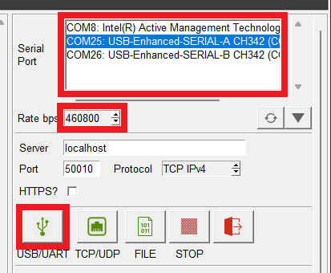

## USB Drivers

### :espressif: ESP32 *(CH340)*
In order to interface with the ESP32 module, the USB driver for the CH340 USB-to-Serial converter must be installed. Users can be download the USB driver from the [manufacturer's website](https://www.wch-ic.com/search?q=CH340&t=downloads):


<div class="grid cards" align="center" markdown>

-   :material-microsoft-windows: **Windows**

	---

	[:octicons-download-16:{ .heart } Download Page for `CH341SER.EXE`](https://www.wch-ic.com/downloads/CH341SER_EXE.html){ .md-button .md-button--primary target="blank" }


-   :material-apple: **MacOS**

	---

	[:octicons-download-16:{ .heart } Download Page for `CH34XSER_MAC.ZIP`](https://www.wch-ic.com/downloads/CH34XSER_MAC_ZIP.html){ .md-button .md-button--primary target="blank" }

</div>

!!! info ":simple-linux: Linux"
	A USB driver should not be required for most Linux based operating systems; the standard Linux CDC-ACM driver is usually sufficient. However, if necessary, users can try the USB driver below:

	<center>
	[:octicons-download-16:{ .heart } Download Page for `CH341SER_LINUX.ZIP`](https://www.wch-ic.com/downloads/CH341SER_LINUX_ZIP.html){ .md-button .md-button--primary target="blank" }
	</center>


### :septentrio: mosaic-X5
In order to interface with the mosaic-X5 on Windows computers, a USB driver must be installed.


<div class="grid cards" markdown>

-   <center>
	:material-microsoft-windows: **Windows**
	</center>

	---

	The USB driver for the mosaic-X5 module can be installed through two methods:

	<article class="annotate" markdown>

	- [RxTools Software Suite](software_overview.md/#rxtools-software-suite) (1)
	- mosaic-X5 GNSS Receiver Module (2)

	</article>

	1. The driver is installed during the [installation process](software_overview.md/#rxtools-software-suite).
	2. The installation file for the Windows USB driver will be available from the mass-storage device when the board is initially connected to the computer.


	??? tip "Having Trouble?"
		For users who are having trouble installing the USB driver, we have an archived version *(v3.0.2)* of the installation file. Users can download [**version 3.0.2**](https://docs.sparkfun.com/SparkFun_GNSS_mosaic-X5/assets/component_documentation/driver/USB_driver_3_0_2_Installer.exe) of the driver, by clicking on the button below.

		<center>
		[:octicons-download-16:{ .heart } Download USB Driver *(v3.0.2)*](https://docs.sparkfun.com/SparkFun_GNSS_mosaic-X5/assets/component_documentation/driver/USB_driver_3_0_2_Installer.exe){ .md-button .md-button--primary target="blank" }
		</center>

		!!! note "Latest Driver"
			This driver version was archived at the time that the [mosaic-X5 hookup guide](https://docs.sparkfun.com/SparkFun_GNSS_mosaic-X5/) was written. *Please do not request for the file to be updated.*

			For the latest USB driver from Septentrio, please install their driver through the [RxTools software suite](software_overview.md/#rxtools-software-suite).

</div>

!!! info ":simple-linux: Linux"
	On Linux, the standard Linux CDC-ACM driver is suitable for the mosaic-X5 module.


## :espressif: ESP32

### Terminal Emulator
In order to configure the WiFi settings on the ESP32, users will need to install a [terminal emulation program](https://learn.sparkfun.com/tutorials/112) on their computer.

=== "Windows"
	For Windows computers, we highly recommend [TeraTerm](https://teratermproject.github.io/index-en.html).

=== "Linux"
	Some Linux operating systems will already have the `screen` terminal emulator preinstalled.

!!! abstract "Need Directions?"
	Check out our hookup guide to install your favorite terminal emulator:

	<div class="grid cards" markdown align="center">

	-   <a href="https://learn.sparkfun.com/tutorials/112">
		<figure markdown>
		
		</figure>

		---

		**Serial Terminal Basics**</a>

	</div>


### RTK Everywhere Firmware

#### System Configuration
Out of the box, the SparkFun RTK products are exceptional GNSS receivers out-of-box and can be used with little or no configuration. Additionally, the line of RTK products from SparkFun are immensely configurable. Please see the [SparkFun RTK Everywhere Firmware Manual](http://docs.sparkfun.com/SparkFun_RTK_Everywhere_Firmware) for detailed descriptions of all the available features on the RTK products


#### Firmware Updates and Customization
The RTK Facet mosaic is completely open-source meaning you have total access to the [firmware code](https://github.com/sparkfun/SparkFun_RTK_Everywhere_Firmware) and [hardware designs](https://github.com/sparkfun/SparkFun_RTK_Facet_mosaic).

From time to time SparkFun will release new firmware for the RTK product line to add and improve functionality. We've made updating the firmware as easy as possible. Please see [Updating RTK Firmware](http://docs.sparkfun.com/SparkFun_RTK_Everywhere_Firmware/firmware_update/) for a step by step tutorial.

#### Bluetooth and NTRIP
The RTK Facet mosaic transmits full NMEA sentences over Bluetooth serial port profile (SPP) at 4Hz and 115200bps. This means that nearly any GIS application that can receive NMEA data over serial port (almost all do) can be used with the RTK Facet mosaic. As long as your device can open a serial port over Bluetooth (also known as SPP) your device can retrieve industry standard NMEA positional data.

Please see the [SparkFun RTK Everywhere Firmware Manual](http://docs.sparkfun.com/SparkFun_RTK_Everywhere_Firmware/connecting_bluetooth/) for step by step instructions.

## :septentrio: mosaic-X5

### :fontawesome-solid-computer: RxTools Software Suite
Even if you aren't necessarily interested in it, we highly recommend that users install the [RXTools software suite](https://www.septentrio.com/en/products/gps-gnss-receiver-software/rxtools) before connecting to the mosaic-X5. For Windows PCs, it also includes the USB driver for the module that enables the Ethernet-over-USB support and virtual `COM` ports.

<article style="text-align: center;" markdown>
[:octicons-download-16:{ .heart } Download the RxTools Software from Septentrio](https://www.septentrio.com/en/products/gps-gnss-receiver-software/rxtools){ .md-button .md-button--primary target="blank" }
</article>

??? info "System Requirements[^1]"

	=== "Operating Systems"

		* Windows 7
		* Windows 8
		* Windows 10
		* Fedora 23 *(or later)* using Qt technology.
			* The standalone tools (except `bin2asc`) will run on older distributions.

	=== "Hardware Requirements"
		The minimal hardware requirements *(1Hz update[^2])*:

		* CPU: 1 GHz processor
		* RAM: 1 GB RAM
		* Screen Resolution: 1024×768 or higher resolution


???+ info "Installation Instructions[^1]"

	=== "Windows"
		Users can install RxTools software suite by running the installation executable[^3](1), located in the `RxTools\windows` directory of the downloaded `*.zip` file[^4]. During the installation process, users will be notified if a previous version of RxTools is already installed then the previous version will be uninstalled. Next, users will need to provide an installation directory for the RxTools software suite. Users will then select which of the following applications[^5] are installed:
		{ .annotate }

		1. For RxTools v22.1.0, the installation filename is `RxTools_22_1_0_Installer.exe` for Windows PCs.

		<!-- Create Break from Annotation (list won't render without comment)-->

		<div class="grid" markdown>

		<div markdown>

		* RxControl
		* SBF Converter
		* SBF Analyzer
		* RxLogger

		</div>

		<div markdown>

		* RxUpgrade
		* RxDownload
		* RxPlanner

		</div>

		<div markdown>

		* Data Link
		* RxAssistant
		* RxLauncher

		</div>

		</div>


	=== "Linux[^1]"
		!!! warning
			It is recommended that users **<span style="color:red">NOT</span>** install RxControl as `root`, for security reasons and to avoid installation overwrites of other system settings. To make RxTools available to more than one user, provide a shared installation directory.

		Users can install RxTools software suite by running the installation binary[^3](1), located in the `RxTools/linux-i386/` directory of the downloaded `*.zip` file[^4]. During the installation, users will be prompted for an installation directory. If there are any previous installations of RxControl, please use a different directory to avoid conflicts.
		{ .annotate }

		1. For RxTools v22.1.0, the installation filename is `RxTools_22_1_0_Installer.bin` for Linux.

		??? info "Permission Settings"
			Once installed, users may need to reconfigure their permission settings:

			<div class="annotate" markdown>

			* RxTools will need rights to access the `/dev/ttyS*` serial ports.

				* To access the serial ports, users must be part of the `uucp` and `lock` groups (1). This can be configured by editing the `/etc/group`[^6] file and adding the username to the lines defining the `uucp` group and the `lock` group.

					For example, when adding the user `jsmith` to the `uucp` group, users would modify the `/etc/group` file as shown below:

					```bash
					{--uucp:x:14:uucp--} # (2)!
					{++uucp:x:14:uucp,jsmith++} # (3)!
					```

				* On Linux machine administered centrally on a local network, ask your system administrator to be included in the `uucp` and `lock` groups.
			* RxTools also needs read/write (`rw`) access(4) to the `/dev/ttyS*` serial ports.

				* Users can change the permissions with the `chmod`[^7] command:

					```bash
					chmod 660 /dev/ttyS<add port> # (5)!>
					```

			</div>

			1. On most Linux operating systems, the `/dev/ttyS*` devices are owned by `root` and belong to the `uucp` group with read/write (`rw`) access. Additionally, the devices are normally locked by writing a file in the `/var/lock/` directory, with the same permissions.
			2. Remove
			3. Replace with this line
			4. By default, users will normally have read/write (`rw`) access to the `/dev/ttyS*` serial ports.
			5. where users must specify the port number<br>*e.g. `/dev/ttyS0` might be port `COM1`*

			!!! note
				In order for these changes to take effect, users must update their environment by logging out and back in.

				Be aware that the X-session has to be restarted as well. On most systems, this can be done by pressing the key combination ++ctrl++ + ++alt++ + ++backspace++

		??? info "64-bit OS"
			In order to run the RxTools on a 64-bit Linux operating system, users might have to install the 32-bit version of the `C` standard library.

			* For Fedora installations, this is the `glibc.i686` package.
			* The equivalent for Debian(/Ubuntu) installations is the `ia32-libs` package.


[^1]: The system requirements and installation instructions are from the RxTools *v22.1.0* user manual. This information may change in later iterations of the software suite. Please refer to the user manual *(of the version you are utilizing)* for the most accurate information.
[^2]: Higher data rates will require higher CPU speed and more memory capacity.
[^3]: Users will need administrative privileges to install the RxTools software.
[^4]: Users may need to extract the RxTools installation files from the downloaded, compressed file.
[^5]: Please see the release notes for the issues and limitations of the RxTools applications.
[^6]: Requires `c` privileges.
[^7]: Changing these permissions also requires `root` privileges.


### :material-web: Web Interface
With the USB driver installed, the mosaic-X5 module supports Ethernet-over-USB. The default IP address allocated for the Ethernet-over-USB interface is `192.168.3.1`. This IP can be entered in any browser to open a connection to the receiver's Web Interface as shown below.

<div class="grid" markdown>

<div markdown>

<figure markdown>
[{ width="600" }](https://docs.sparkfun.com/SparkFun_GNSS_mosaic-X5/assets/img/hookup_guide/navigation_tabs.png "Click to enlarge")
<figcaption markdown>All the drop-down navigation tabs in the web interface.</figcaption>
</figure>

</div>

<div markdown>

<center>
<article class="video-500px">
<iframe src="https://www.youtube.com/embed/hrL5J6Q5gX8" title="Septentrio: Getting started with the Septentrio mosaic receiver module" frameborder="0" allow="accelerometer; autoplay; clipboard-write; encrypted-media; gyroscope; picture-in-picture" allowfullscreen></iframe>
</article>
</center>

</div>

</div>


!!! info
	The default IP address cannot be changed; this feature is only to be used when a single receiver is connected to your computer.


## :fontawesome-solid-computer: PyGPSClient
As an alternative to GIS apps on mobile devices, for users with computers, we recommend [PyGPSClient](https://github.com/semuconsulting/PyGPSClient) as an option for viewing the data from the NMEA messages and connecting to an NTRIP caster. However, users should be aware that this GUI interface is currently limited to only receiving UART messages and cannot send messages to configure the mosaic-X5 GNSS module.


!!! warning "Software Limitations"
	With this software, users will only be able to view the data from the NMEA messages and connect to an NTRIP caster. Users will not be able to configure the mosaic-X5 GNSS module with the built-in console.


??? info "Resources"
	For additional information, users can refer to the following resources for the PyGPSClient software:

	- :material-github: [GitHub Repository](https://github.com/semuconsulting/PyGPSClient)
	- [Installation Instructions](https://github.com/semuconsulting/PyGPSClient?tab=readme-ov-file#installation)
	- [PyPI Project](https://pypi.org/project/pygpsclient/)


#### Installation
There are a variety of [installation methods](https://github.com/semuconsulting/PyGPSClient?tab=readme-ov-file#installation) detailed in the GitHub repository's `README.md` file. However, we recommend utilizing the `pip` installation method. Depending on how Python is installed on your computer, one of the following commands should allow users to install the software.


!!! terminal "Installation Commands"
	```bash
	python3 -m pip install pygpsclient
	```
	```bash
	pip install pygpsclient
	```

	!!! tip
		This installation method requires an internet connection. Additionally, users will also need administrative privileges *(or root access `sudo`)* for the installation.


#### Connecting to the mosaic-X5
Before users can connect to the SparkPNT RTK Facet mosaic, they will need to specify the settings of the UART port in PyGPSClient. Once configured, users can select the <kbd>:material-usb:</kbd> button and PyGPSClient will automatically attempt to connect to the GNSS module.

- Below, is a list of the default settings for `UART` port of the SparkPNT RTK Facet mosaic. These settings should be selected in the configuration menu.

<div class="grid" markdown>

<div markdown>

<figure markdown>
[{ width="400" }](./assets/img/hookup_guide/pygpsclient-uart_settings.png "Click to enlarge")
<figcaption markdown>
Specify the settings for the UART port in QGNSS.
</figcaption>
</figure>

</div>


<div markdown>

!!! info "Default Settings"
	The UART port of the RTK Facet mosaic will have the following default configuration:

	- Baudrate: 115200bps
	- Data Bits: 8
	- Parity: No
	- Stop Bits: 1
	- Flow Control: None

</div>

</div>
